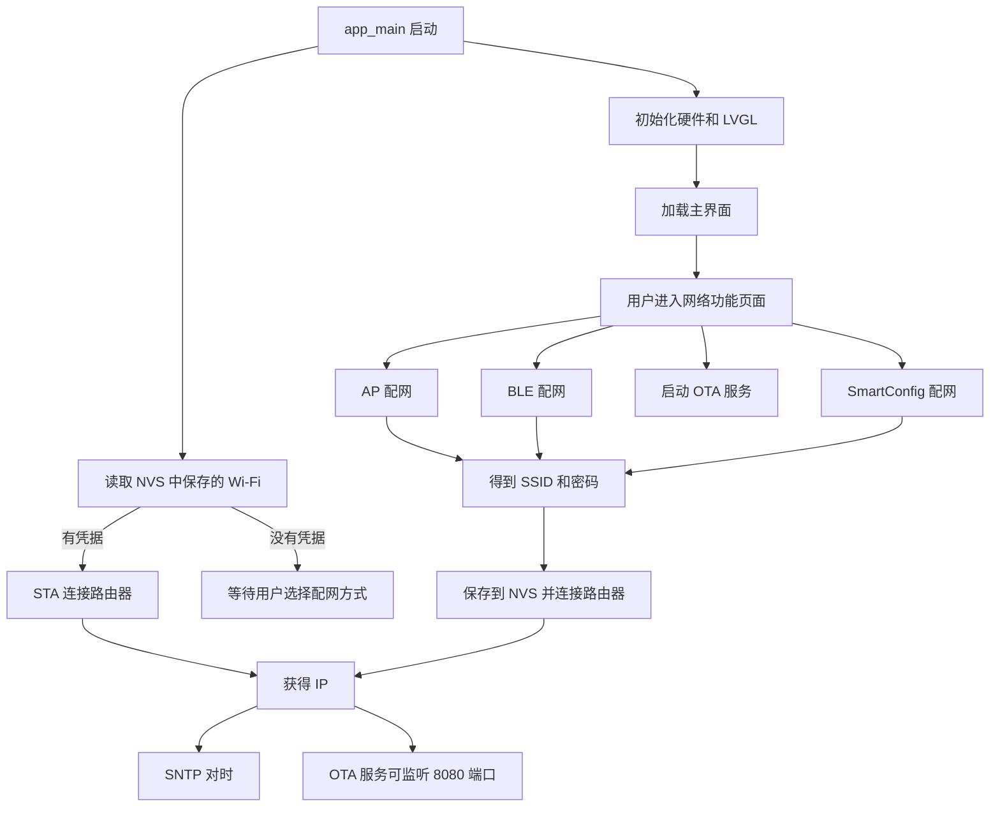
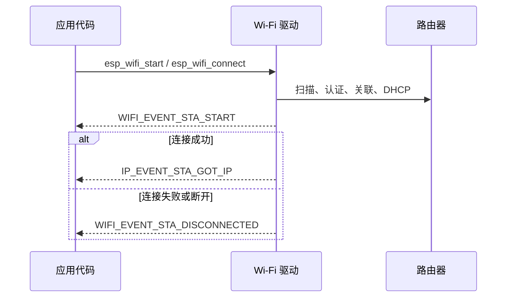
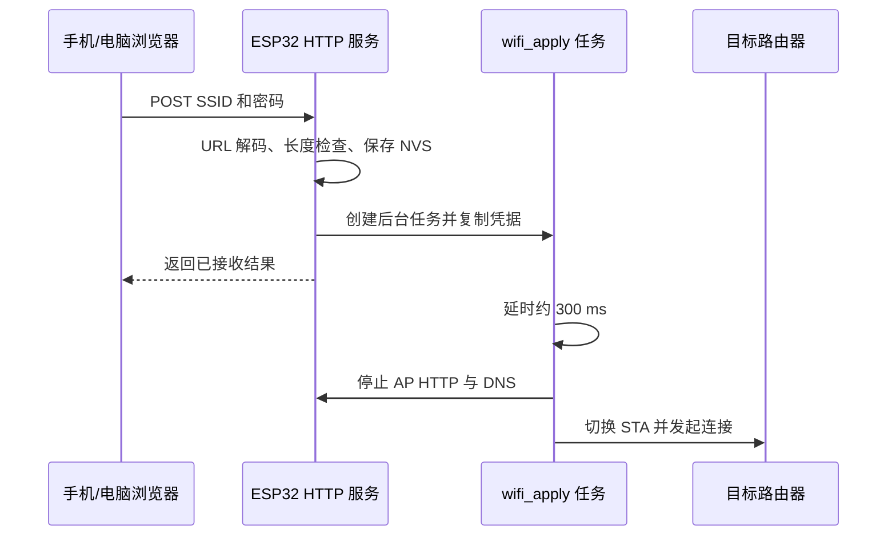
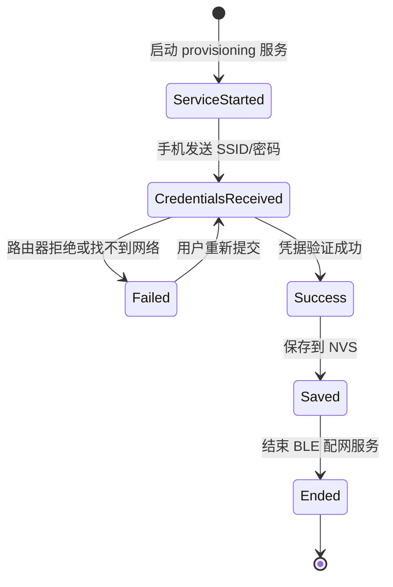
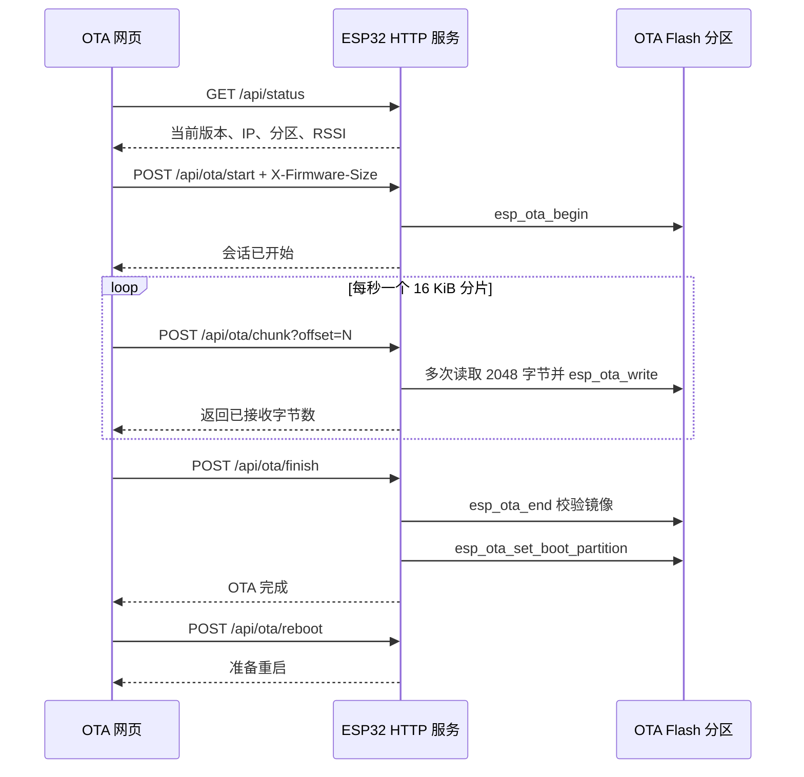

# ESP32-S3 FreeRTOS、Wi-Fi 配网与 OTA 学习指南

> 适用工程：`ESP32S3_BOARD`  
> 适合读者：已经会使用 LVGL，但刚开始接触 FreeRTOS、Wi-Fi、蓝牙配网和 OTA。  
> 本文只解释当前工程中已经存在的实现，不额外假设工程具备其他功能。

## 1. 先建立整体认识

这份程序可以先理解成 4 层：

| 层次 | 主要目录或文件 | 负责什么 |
| --- | --- | --- |
| 硬件和系统启动 | [`main/main.c`](../main/main.c) | 初始化 NVS、SD 卡、I2C、触摸、LCD、LVGL，并尝试连接保存过的 Wi-Fi |
| 界面和按键 | [`components/GUI_GUIDER/custom/custom.c`](../components/GUI_GUIDER/custom/custom.c) | 创建页面、注册按键事件、启动配网或 OTA 功能 |
| 网络配网 | [`components/WIFI_MANAGER/wifi_manager.c`](../components/WIFI_MANAGER/wifi_manager.c) | 管理 STA、AP、BLE、SmartConfig、NVS 凭据和 SNTP 时间同步 |
| 在线升级 | [`components/WIFI_OTA/wifi_ota.c`](../components/WIFI_OTA/wifi_ota.c) | 提供 OTA 网页和 HTTP 接口，将固件分片写入 OTA 分区 |

网页资源位于：

- [`components/WIFI_MANAGER/ap_provision.html`](../components/WIFI_MANAGER/ap_provision.html)：AP 配网页面。
- [`components/WIFI_OTA/ota.html`](../components/WIFI_OTA/ota.html)：Wi-Fi OTA 页面。

整个程序的大致关系如下：



## 2. 阅读代码前先认识 5 个概念

### 2.1 回调函数

回调函数不是我们主动在当前位置调用的函数，而是先把函数地址交给系统，等事件发生后由系统调用。

本工程中的典型例子：

```c
lv_obj_add_event_cb(button, network_button_event_cb,
                    LV_EVENT_CLICKED, (void *)ACTION_AP);
```

这句话的意思是：

1. 给 `button` 注册点击事件。
2. 用户点击后，LVGL 调用 `network_button_event_cb()`。
3. `ACTION_AP` 作为用户数据一并传给回调函数。

Wi-Fi 事件处理函数也是同样的思想。驱动发现“连接断开”或“已经获得 IP”后，再调用我们注册的事件函数。

### 2.2 事件

事件代表“某件事已经发生”。例如：

- `WIFI_EVENT_STA_START`：Wi-Fi STA 已启动。
- `WIFI_EVENT_STA_DISCONNECTED`：设备与路由器断开。
- `IP_EVENT_STA_GOT_IP`：路由器已经给 ESP32 分配 IP。
- `SC_EVENT_GOT_SSID_PSWD`：SmartConfig 已收到 SSID 和密码。
- `WIFI_PROV_CRED_SUCCESS`：BLE 配网凭据验证成功。

事件驱动的好处是不用写一个循环不停询问“连上了吗”，系统在状态发生变化时会通知程序。

### 2.3 任务 Task

FreeRTOS 任务可以暂时理解为一条独立执行路线。多个任务快速交替运行，看起来像同时执行。

例如：

- LVGL 任务负责刷新界面和分发界面事件。
- `weather_update_task()` 负责请求天气。
- `network_action_task()` 负责启动配网或 OTA。
- `captive_dns_task()` 负责处理 AP 配网时的 DNS 请求。
- HTTP 服务自身也有任务负责接收浏览器请求。

### 2.4 状态

联网不是一次函数调用立刻完成，而是一个状态变化过程。例如 STA 连接：

```text
未初始化 -> Wi-Fi 已启动 -> 正在连接 -> 已获得 IP
                              |          |
                              +--断开----+
```

因此代码中会使用这些状态变量：

```c
s_initialized
s_wifi_started
s_connecting
s_connected
s_provisioning
s_smartconfig_started
```

它们帮助不同回调和任务判断现在可以做什么。

### 2.5 句柄 Handle

句柄可以理解成系统对象的“身份证”或“遥控器”。例如：

- `TaskHandle_t`：任务句柄。
- `httpd_handle_t`：HTTP 服务器句柄。
- `SemaphoreHandle_t`：互斥锁或信号量句柄。
- `esp_ota_handle_t`：当前 OTA 写入会话句柄。

拿到句柄后，才能继续控制对应对象，例如停止 HTTP 服务或向 OTA 分区写数据。

## 3. 启动过程：`app_main()` 做了什么

ESP-IDF 工程不会从普通 C 程序的 `main()` 开始，而是由系统完成底层启动后调用：

```c
void app_main(void)
```

当前工程的启动顺序可以概括为：

1. 初始化 NVS。
2. 初始化网络接口层。
3. 初始化 LED、SD 卡、I2C、IO 扩展芯片、触摸屏和 LCD。
4. 初始化 LVGL，并为显示创建绘图缓冲区。
5. 显示资源准备好以后，尝试读取并连接以前保存的 Wi-Fi。
6. 注册触摸输入设备。
7. 创建主界面，执行 `events_init()` 和 `custom_init()`。
8. `app_main()` 留在 LED 闪烁循环中，并通过 `vTaskDelay()` 主动让出 CPU。

### 3.1 为什么 NVS 要最先初始化

NVS 是 ESP32 Flash 上的小型键值数据库。本工程会把 Wi-Fi 名称和密码存到 NVS：

```text
namespace: wifi_config
key: ssid
key: password
```

如果 NVS 版本变化或空间耗尽，代码会擦除 NVS 后重新初始化。这意味着这种异常情况下以前保存的 Wi-Fi 凭据也会消失，需要重新配网。

### 3.2 为什么先创建显示缓冲区，再启动 Wi-Fi

LCD、LVGL、Wi-Fi、HTTP 和蓝牙都要占用 RAM。当前程序先保证显示缓冲区创建成功，再启动已保存的 Wi-Fi 连接，可以降低系统启动阶段内存竞争导致失败或重启的风险。

当前 RGB565 绘图缓冲区高度为 40 行。若屏幕宽度是 240 像素，单缓冲区的大致大小是：

```text
240 × 40 × 2 字节 = 19,200 字节
```

`display == NULL` 时程序会记录错误并停止后续界面初始化，避免继续解引用空指针导致崩溃。

## 4. FreeRTOS 在这份程序里是怎样工作的

### 4.1 创建任务的参数

以网络功能任务为例：

```c
xTaskCreate(network_action_task,
            "ui_network",
            6144,
            (void *)action,
            4,
            NULL);
```

参数依次表示：

1. `network_action_task`：任务入口函数。
2. `"ui_network"`：任务名称，便于日志和调试。
3. `6144`：任务栈大小。在 ESP-IDF 的 FreeRTOS API 中这里按字节计算。
4. `(void *)action`：传给任务的参数。
5. `4`：任务优先级，数字越大通常优先级越高。
6. `NULL`：这里不需要保存任务句柄。

任务函数通常长这样：

```c
static void example_task(void *argument)
{
    // 做自己的工作

    vTaskDelete(NULL); // 删除当前任务，不能直接从任务函数 return
}
```

### 4.2 当前工程中的主要任务

| 任务 | 栈大小 | 优先级 | 作用 |
| --- | ---: | ---: | --- |
| `app_main` 所在任务 | 由工程配置决定 | 由系统决定 | 初始化整个应用，之后控制 LED |
| LVGL 任务 | 由 LVGL port 配置决定 | 由组件配置决定 | 刷新界面、处理触摸和 LVGL 事件 |
| `ui_network` | 6144 字节 | 4 | 启动 AP、BLE、SmartConfig 或 OTA |
| `weather` | 6144 字节 | 3 | 周期性获取天气并更新界面 |
| `wifi_apply` | 4096 字节 | 3 | AP 网页提交后停止 AP，再连接目标路由器 |
| `captive_dns` | 4096 字节 | 3 | AP 配网时响应 DNS 查询 |
| `sntp_monitor` | 3072 字节 | 3 | 监视网络对时结果并尝试备用服务器 |
| `ota_reboot` | 2048 字节 | 5 | OTA 完成后延时重启 |

只有使用 `xTaskCreatePinnedToCore()` 创建的任务才明确绑定 CPU 核心。本工程把部分网络辅助任务固定在 core 1；普通 `xTaskCreate()` 创建的任务由调度器安排。

### 4.3 `vTaskDelay()` 为什么重要

```c
vTaskDelay(pdMS_TO_TICKS(500));
```

这不是简单地浪费时间。任务延时期间处于阻塞状态，CPU 可以运行其他任务。

不要用这种忙等待代替它：

```c
while (time_not_reached) {
    // 什么也不做，但一直占着 CPU
}
```

### 4.4 为什么耗时联网动作不直接放进 LVGL 点击回调

扫描 Wi-Fi、启动协议和等待网络操作都可能花费较长时间。如果直接在 LVGL 点击回调里执行，LVGL 任务会被阻塞，表现为：

- 页面不刷新。
- 按钮像卡死。
- 触摸响应变慢。
- 看门狗可能认为任务长期没有运行。

所以当前程序的点击回调只识别动作，然后创建 `network_action_task()` 在后台启动功能。

### 4.5 LVGL 不是随便在哪个任务都能操作

LVGL 默认不是线程安全的。非 LVGL 任务要修改界面时，需要先锁住 LVGL：

```c
lvgl_port_lock(0);
// 更新 LVGL 控件
lvgl_port_unlock();
```

本工程的天气任务就是这种做法。锁的作用是避免天气任务和 LVGL 刷新任务同时修改对象，造成随机崩溃或画面异常。

### 4.6 `volatile` 不等于线程锁

`s_network_action_running` 使用了 `volatile`，它主要告诉编译器每次都应重新读取这个变量。它不是完整的互斥锁，不能保证复杂的多任务操作天然安全。

这里它只被用作一个轻量的“按钮启动动作正在执行”标记。真正需要保护一组共享数据时，例如 OTA 会话，就使用了 FreeRTOS mutex。

## 5. ESP-IDF 事件循环

Wi-Fi 驱动在内部任务中工作。应用通过事件循环接收结果：

```c
esp_event_handler_register(WIFI_EVENT,
                           ESP_EVENT_ANY_ID,
                           &wifi_event_handler,
                           NULL);
```

意思是把 `wifi_event_handler()` 注册为所有 Wi-Fi 事件的处理函数。

另一个注册用于监听 STA 获得 IP：

```c
esp_event_handler_register(IP_EVENT,
                           IP_EVENT_STA_GOT_IP,
                           &wifi_event_handler,
                           NULL);
```

执行过程是：



因此 `esp_wifi_connect()` 返回 `ESP_OK` 只表示“连接动作已经成功发起”，不表示已经拿到 IP。真正联网成功要看 `IP_EVENT_STA_GOT_IP`。

## 6. Wi-Fi 的三种模式

### 6.1 STA 模式

STA 就是让 ESP32 像手机、电脑一样连接路由器：

```text
ESP32 ----连接----> 家庭路由器 ----> 局域网/互联网
```

连接成功后，ESP32 会获得一个局域网 IP，例如 `192.168.1.105`。Wi-Fi OTA 使用的就是这种模式。

### 6.2 AP 模式

AP 是让 ESP32 自己成为一个热点：

```text
手机/电脑 ----连接----> ESP32 热点 ESP_AP
```

此时不需要已有路由器连接，用户可先访问 ESP32 提供的配网页面。

### 6.3 APSTA 模式

APSTA 表示 AP 和 STA 能力同时启用。AP 配网阶段先让 ESP32 提供热点；收到用户填写的凭据后，再停止配网页面并用 STA 连接目标路由器。

ESP32-S3 的 Wi-Fi 工作在 2.4 GHz。要配的路由器需要提供 2.4 GHz 网络；仅有 5 GHz 的 SSID 无法连接。

## 7. `wifi_manager` 的公共初始化

所有配网方式最终都依赖 [`wifi_manager_init()`](../components/WIFI_MANAGER/wifi_manager.c)。这个函数采用“只初始化一次”的设计：

```c
if (s_initialized) {
    return ESP_OK;
}
```

它主要完成：

1. 初始化 TCP/IP 网络接口层。
2. 创建默认 ESP-IDF 事件循环。
3. 创建 STA 网络接口。
4. 初始化 Wi-Fi 驱动。
5. 将 Wi-Fi 驱动存储方式设为 `WIFI_STORAGE_RAM`。
6. 注册 Wi-Fi、IP、SmartConfig 和 BLE provisioning 事件。

使用 `WIFI_STORAGE_RAM` 后，Wi-Fi 驱动本身不负责把凭据长期写入默认 NVS。本工程用自己的 `save_credentials()` 和 `load_credentials()` 管理 `wifi_config` 命名空间，保存位置和时机更明确。

## 8. 上电自动联网和 NVS

上电时会调用：

```c
wifi_manager_start_saved_connection();
```

调用链如下：

```text
wifi_manager_start_saved_connection
    -> load_credentials
        -> nvs_open("wifi_config", NVS_READONLY)
        -> nvs_get_str("ssid")
        -> nvs_get_str("password")
    -> wifi_manager_init
    -> start_station
        -> esp_wifi_set_mode(WIFI_MODE_STA)
        -> esp_wifi_set_config
        -> esp_wifi_start / esp_wifi_connect
```

第一次开机没有保存过凭据时，`ESP_ERR_NOT_FOUND` 是正常情况，不代表程序故障。此时等待用户选择一种配网方式即可。

### 凭据保存时机

- AP 配网：网页提交并完成参数检查后保存。
- BLE 配网：只有收到 `WIFI_PROV_CRED_SUCCESS`，即凭据验证成功后才保存。
- SmartConfig：收到 SSID 和密码后保存，并尝试连接。

### 安全提醒

SSID 和密码当前按普通 NVS 字符串保存。如果产品对凭据保护要求较高，应进一步研究 Flash Encryption 和 NVS Encryption。是否启用这些能力取决于工程的安全配置，不能只靠当前两个保存函数判断。

## 9. 从 UI 按键到网络功能的调用链

`custom_init()` 给 4 个按钮注册同一个回调，并用不同动作值加以区分：

```text
AP 按钮          -> ACTION_AP
BLE 按钮         -> ACTION_BLE
SmartConfig 按钮 -> ACTION_SMARTCONFIG
OTA 按钮         -> ACTION_OTA
```

点击后的完整调用链：

```text
LV_EVENT_CLICKED
    -> network_button_event_cb
        -> 检查 s_network_action_running
        -> xTaskCreate(network_action_task)
            -> AP: wifi_manager_start_ap_provisioning
            -> BLE: wifi_manager_start_ble_provisioning
            -> SmartConfig: wifi_manager_start_smartconfig_provisioning
            -> OTA: wifi_manager_init + wifi_ota_start
        -> 清除启动动作标志
        -> vTaskDelete(NULL)
```

需要注意两点：

1. `s_network_action_running` 只保护“启动动作执行期间”，并不代表配网服务的整个生命周期。
2. `wifi_manager` 内部还会检查 `s_provisioning`。当一种配网正在运行时，再启动另一种会返回状态错误，避免多个配网协议互相打架。

`Back` 按钮只负责切回主界面，不会停止已经启动的 AP、BLE、SmartConfig 或 OTA 服务。

## 10. AP 配网原理和代码流程

### 10.1 用户看到的过程

1. 在设备界面点击 AP 配网。
2. ESP32 创建名为 `ESP_AP` 的开放热点。
3. 手机或电脑连接 `ESP_AP`。
4. 浏览器打开 `http://192.168.4.1/`。
5. 网页显示扫描到的 2.4 GHz Wi-Fi。
6. 用户选择 SSID、输入密码并提交。
7. ESP32 保存凭据、关闭配网页面和热点，再连接目标路由器。

当前热点没有密码，适合开发调试。正式产品应根据使用场景评估热点认证、页面鉴权和超时关闭机制。

### 10.2 启动 AP 服务

入口函数：

```c
wifi_manager_start_ap_provisioning();
```

它主要完成：

```text
初始化 wifi_manager
    -> 检查是否已有其他配网方式运行
    -> 创建 AP 网络接口
    -> 设置热点 SSID 为 ESP_AP
    -> 切换到 APSTA 模式
    -> 启动 Wi-Fi
    -> 扫描附近 Wi-Fi
    -> 启动 HTTP 服务
    -> 启动 DNS 服务
```

### 10.3 AP 网页接口

| 方法 | 地址 | 用途 |
| --- | --- | --- |
| GET | `/` 或其他普通路径 | 返回 AP 配网 HTML 页面 |
| GET | `/api/scan` | 返回扫描到的 Wi-Fi 列表 |
| GET | `/api/status` | 返回当前连接和配网状态 |
| POST | `/api/configure` | 接收网页提交的 SSID 和密码 |
| POST | `/configure` | 兼容普通表单提交 |

网页不是从 SD 卡动态读取，而是在编译时嵌入固件。组件 CMake 中的 `EMBED_FILES` 会把 HTML 转成固件中的二进制数据，C 代码通过链接器生成的 `_binary_..._start` 和 `_binary_..._end` 符号访问它。

这意味着修改 HTML 后需要重新编译并烧录固件。

### 10.4 为什么需要结束 chunked HTTP 响应

`/api/scan` 使用分块响应逐段发送 JSON。分块发送完成后必须调用：

```c
httpd_resp_send_chunk(request, NULL, 0);
```

这个长度为 0 的结束块告诉浏览器“本次响应已经发完”。如果缺少它，浏览器会继续等待，因此页面会一直显示“正在扫描 Wi-Fi”。

### 10.5 浏览器提交凭据以后发生什么



这里先给浏览器返回响应，再稍后关掉热点，是为了让浏览器有机会收到“配置已提交”的结果。

### 10.6 Captive Portal DNS 是什么

手机连上一个没有互联网的热点时，经常会自动探测登录页面。`captive_dns_task()` 监听 UDP 53 端口，把域名查询统一回答为：

```text
192.168.4.1
```

这样能提高系统自动弹出配网页面的概率。但不同手机和系统行为不同，所以最可靠的方法仍然是手动访问 `http://192.168.4.1/`。

### 10.7 扫描为何会暂时耗时

`esp_wifi_scan_start(NULL, true)` 的第二个参数为 `true`，表示同步阻塞扫描。它会等待扫描完成后再返回。

首次 AP 启动由后台 `ui_network` 任务执行，所以不会直接卡住 LVGL。网页再次请求 `/api/scan` 时，HTTP 服务处理该请求会等待扫描完成，这几秒内该请求处于处理中是正常的。

## 11. BLE 配网原理和代码流程

### 11.1 它不是普通蓝牙串口

本工程使用 ESP-IDF 官方 Unified Provisioning 协议，传输层是 BLE：

```c
wifi_prov_mgr_init(... wifi_prov_scheme_ble ...);
```

因此不能用普通蓝牙串口助手直接发送 Wi-Fi 名称和密码。手机端应使用支持 Espressif 配网协议的应用，例如：

- Android/iOS：Espressif 官方 `ESP BLE Provisioning` / `ESP Provisioning` 应用。

不同应用商店中的名称可能略有变化，判断标准是它是否明确支持 Espressif Unified Provisioning 或 ESP BLE Provisioning。

### 11.2 当前 BLE 配网参数

| 项目 | 当前值 |
| --- | --- |
| 设备广播名称 | `PROV_` 加芯片 MAC 地址末 3 字节 |
| Security | Security 1 |
| Proof of Possession | `esp32s3` |
| 传输方式 | BLE |

例如设备可能显示为：

```text
PROV_A1B2C3
```

在应用里选择该设备，并输入 PoP：

```text
esp32s3
```

Security 1 会基于协议建立加密会话；PoP 用于证明手机知道设备预设口令。它比完全无验证的明文传输更合适，但量产时不应让所有设备永远共用一个公开固定 PoP，可以考虑每台设备唯一 PoP、二维码或其他安全注册方式。

### 11.3 BLE 配网事件过程



对应事件的重点：

- `WIFI_PROV_START`：配网服务开始。
- `WIFI_PROV_CRED_RECV`：已经收到凭据，只先复制到待处理结构体。
- `WIFI_PROV_CRED_FAIL`：验证失败，不保存错误凭据。
- `WIFI_PROV_CRED_SUCCESS`：路由器验证通过，此时保存凭据。
- `WIFI_PROV_END`：释放 provisioning manager，清理配网状态。

“收到凭据”与“凭据有效”是两件事。等成功事件后再保存，可以防止输错密码后设备下次启动还反复连接错误网络。

## 12. SmartConfig 配网原理和代码流程

SmartConfig 不要求 ESP32 自己开热点。手机把路由器信息编码到局域网数据包中，ESP32 在不同 Wi-Fi 信道监听并解析。

当前程序同时启用：

```c
SC_TYPE_ESPTOUCH_AIRKISS
```

也就是支持 ESPTouch 和 AirKiss 类型。

### 12.1 用户操作过程

1. 手机先连接目标 2.4 GHz Wi-Fi。
2. 在设备界面点击 SmartConfig。
3. 手机打开支持 ESPTouch/AirKiss 的配网应用或小程序。
4. 输入当前 Wi-Fi 密码并开始配网。
5. ESP32 扫描信道并接收凭据。
6. ESP32 保存凭据并连接路由器。
7. 协议完成 ACK 后停止 SmartConfig。

SmartConfig 客户端必须与当前协议兼容。普通系统 Wi-Fi 设置页本身不会发送 SmartConfig 数据。

### 12.2 代码事件流程

```text
wifi_manager_start_smartconfig_provisioning
    -> 初始化 Wi-Fi
    -> 设置 STA 模式
    -> 启动 Wi-Fi
    -> WIFI_EVENT_STA_START
    -> esp_smartconfig_start
    -> SC_EVENT_SCAN_DONE
    -> SC_EVENT_FOUND_CHANNEL
    -> SC_EVENT_GOT_SSID_PSWD
        -> 保存 SSID 和密码
        -> esp_wifi_set_config
        -> esp_wifi_connect
    -> SC_EVENT_SEND_ACK_DONE
        -> esp_smartconfig_stop
```

如果 Wi-Fi 驱动本来已经启动，代码会直接启动 SmartConfig；如果还没启动，则等 `WIFI_EVENT_STA_START` 再启动。这是因为协议监听依赖已经工作的 Wi-Fi 驱动。

### 12.3 SmartConfig 的实际限制

- 手机和目标路由器通常要处于同一个 2.4 GHz 网络环境。
- 某些路由器的 AP 隔离、组播/广播限制可能影响配网。
- 手机系统权限、厂商网络策略和客户端实现也会影响成功率。
- 它没有 AP 网页那样直观的设备端交互，排查问题时应重点查看 SmartConfig 事件日志。

## 13. 三种配网方式对比

| 特性 | AP 配网 | BLE 配网 | SmartConfig |
| --- | --- | --- | --- |
| 手机先连接 ESP32 热点 | 需要 | 不需要 | 不需要 |
| 需要蓝牙 | 不需要 | 需要 | 不需要 |
| 需要专用应用 | 浏览器即可 | 需要支持官方协议的应用 | 需要 ESPTouch/AirKiss 客户端 |
| 用户体验 | 直观，可列出 Wi-Fi | 较流畅，不切换 Wi-Fi | 操作少，但环境兼容性差异较大 |
| 当前安全设置 | ESP_AP 为开放热点 | Security 1 + PoP | 由 SmartConfig 协议和网络环境决定 |
| 凭据最终保存位置 | 自定义 NVS | 自定义 NVS | 自定义 NVS |
| 最终目标 | 切换为 STA 连接路由器 | STA 连接路由器 | STA 连接路由器 |

三种方式只是“把 SSID 和密码送到 ESP32”的路径不同。最终都会进入 STA 联网流程，并在拿到 IP 后使用同一套后续网络能力。

## 14. 获得 IP 后的 SNTP 时间同步

当收到 `IP_EVENT_STA_GOT_IP` 时，程序会启动 SNTP 对时。

当前主要时间服务器为：

```text
ntp.aliyun.com
```

监控任务最多等待约 15 秒；如果未成功，再尝试：

```text
pool.ntp.org
```

时区使用：

```text
CST-8
```

这表示中国标准时间 UTC+8。这里 POSIX 时区字符串的正负号写法容易让初学者困惑：`CST-8` 表示本地时间比 UTC 快 8 小时。

界面每秒执行一次 `status_timer_cb()`。只有 `wifi_manager_has_time()` 表明系统时间有效时，才使用真实时间更新主界面时钟。

## 15. Wi-Fi OTA 是什么

OTA 是 Over-The-Air，即通过网络更新固件，不再每次使用 USB 数据线烧录。

当前流程是：

```text
电脑选择 .bin 文件
    -> 浏览器按 16 KiB 分片
    -> 每秒向 ESP32 发送一片
    -> ESP32 写入“下一 OTA 分区”
    -> 完整接收后校验镜像
    -> 把下一启动分区改为新固件
    -> 用户点击重启
```

## 16. OTA 分区为什么不能直接覆盖正在运行的程序

当前分区表 [`partitions-16MiB.csv`](../partitions-16MiB.csv) 中包含：

| 分区 | 大小 | 用途 |
| --- | ---: | --- |
| `factory` | 0x280000 | 工厂应用固件 |
| `ota_0` | 0x280000 | OTA 应用槽位 0 |
| `ota_1` | 0x280000 | OTA 应用槽位 1 |
| `otadata` | 0x2000 | 保存 OTA 启动选择信息 |

ESP32 正在从某个应用分区运行时，升级数据写入另一个可用 OTA 分区。完整写入并校验成功后，`esp_ota_set_boot_partition()` 修改下次启动目标。


当前代码会验证镜像并切换启动分区，但没有在这个组件里实现“新固件启动后确认有效/取消回滚”的业务流程。因此不要把它理解成已经具备完整的产品级健康检查和自动回滚策略。

## 17. 启动和访问 OTA 网页

### 17.1 必要条件

1. ESP32 已经通过任意方式连接到路由器，并获得局域网 IP。
2. 电脑连接同一个局域网。
3. 在设备 UI 中点击 OTA 按钮，启动 OTA 服务。

`wifi_ota_start()` 的设计是：

- 如果当前已经联网，立即启动 HTTP 服务。
- 如果还没获得 IP，先注册 IP 事件，等联网后自动启动服务。
- 重复调用不会重复创建服务。

### 17.2 访问地址

浏览器打开：

```text
http://设备IP:8080/
```

例如日志显示设备 IP 为 `192.168.1.105`，就访问：

```text
http://192.168.1.105:8080/
```

代码中的 `32769` 是 ESP-IDF HTTP 服务器内部使用的控制端口，不是浏览器上传数据的端口。用户只需要访问 `8080`。

### 17.3 应选择哪个固件文件

正常编译后，选择应用程序固件：

```text
build/10_spilcd.bin
```

不要选择：

```text
build/bootloader/bootloader.bin
build/partition_table/partition-table.bin
```

OTA 接口写入的是应用分区，必须上传应用固件镜像。

## 18. OTA 网页与 ESP32 的数据交互

OTA HTTP 服务运行在 8080 端口，接口如下：

| 方法 | 地址 | 用途 |
| --- | --- | --- |
| GET | `/` | 返回 OTA 网页 |
| GET | `/api/status` | 返回版本、分区、进度、IP、RSSI 等状态 |
| POST | `/api/ota/start` | 创建 OTA 会话，准备目标分区 |
| POST | `/api/ota/chunk?offset=...` | 发送一片固件数据 |
| POST | `/api/ota/finish` | 完成写入并校验、设置启动分区 |
| POST | `/api/ota/abort` | 中止当前升级 |
| POST | `/api/ota/reboot` | OTA 完成后重启设备 |

### 18.1 一次完整上传



网页端每个逻辑帧最大 16 KiB，并在每帧之间等待约 1 秒，因此速度是有意限制的。这样可以清楚观察每次 TX/RX，也减小持续高速上传对设备其他任务的影响。

### 18.2 为什么 16 KiB 分片还要用 2048 字节接收缓冲区

浏览器一次 HTTP 请求可以带 16 KiB 数据，但 ESP32 不需要在栈上同时放下整个请求体。服务器用 2048 字节缓冲区循环接收：

```text
16 KiB HTTP 分片
    -> 读 2048 B -> 写 Flash
    -> 读 2048 B -> 写 Flash
    -> ...
```

这样能减少任务栈内存使用。

### 18.3 为什么每片必须带 offset

服务器会检查 URL 中的 `offset` 是否等于当前已经接收的字节数：

```text
请求 offset == session.received_size
```

如果浏览器重复发送旧分片、跳过某片或顺序错误，服务器就会拒绝，避免在错误位置继续拼接固件。

### 18.4 OTA 状态机

当前 OTA 会话有这些状态：

```text
IDLE -> RECEIVING -> COMPLETE
           |            |
           +-> ERROR    +-> REBOOT
           |
           +-> ABORTED
```

- `IDLE`：没有升级。
- `RECEIVING`：正在接收固件。
- `COMPLETE`：完整写入、校验并设置启动分区成功。
- `ABORTED`：用户中止。
- `ERROR`：写入、长度或校验等过程发生错误。

### 18.5 OTA mutex 保护什么

状态查询、上传、终止和重启请求可能在接近的时间到来。它们都会访问：

- OTA handle。
- 目标分区指针。
- 已接收大小。
- 总大小。
- 当前状态。

代码使用 mutex：

```c
xSemaphoreTake(s_ota_mutex, portMAX_DELAY);
// 读取或修改 OTA 会话
xSemaphoreGive(s_ota_mutex);
```

这样同一时刻只有一个执行路径能修改这组共享状态，避免“正在写入时又被 abort”之类的竞争。

### 18.6 OTA 安全边界

当前 OTA 是局域网 HTTP 服务，未使用 HTTPS，也没有登录鉴权。能访问设备 `IP:8080` 的局域网客户端可能尝试操作 OTA 接口。

开发阶段使用方便；用于正式产品时，应根据威胁模型考虑鉴权、HTTPS、固件签名、Secure Boot、Flash Encryption、服务超时关闭等机制。

## 19. AP 与 OTA 网页为何能直接写 HTML

两个网页都是静态 HTML/CSS/JavaScript，但 JavaScript 会调用 ESP32 的 HTTP API。

例如逻辑上相当于：

```javascript
const response = await fetch('/api/status');
const status = await response.json();
```

因为网页本身就是从 ESP32 下载的，所以相对路径 `/api/status` 自动指向同一台 ESP32：

```text
AP 网页来源  http://192.168.4.1/
接口地址     http://192.168.4.1/api/status

OTA 网页来源 http://192.168.1.105:8080/
接口地址     http://192.168.1.105:8080/api/status
```

网页显示的 TX/RX 记录，代表浏览器与 ESP32 HTTP 接口之间的请求和响应，不是蓝牙串口日志。

## 20. 实际使用步骤

### 20.1 第一次使用：AP 配网

1. 烧录固件并打开串口监视器。
2. 进入网络功能页面，点击 AP。
3. 手机或电脑连接 `ESP_AP`。
4. 浏览器访问 `http://192.168.4.1/`。
5. 选择 2.4 GHz Wi-Fi，输入密码，提交。
6. 设备热点会关闭并连接目标路由器。
7. 查看串口中的 `got ip` 日志确认设备 IP。

### 20.2 第一次使用：BLE 配网

1. 手机上安装支持 Espressif Unified Provisioning 的官方配网应用。
2. 点击设备上的 BLE 按钮。
3. 在应用里寻找 `PROV_xxxxxx`。
4. 输入 PoP：`esp32s3`。
5. 选择 2.4 GHz Wi-Fi 并输入密码。
6. 等待应用和串口日志提示配网成功。

### 20.3 第一次使用：SmartConfig

1. 手机连接目标 2.4 GHz Wi-Fi。
2. 点击设备上的 SmartConfig 按钮。
3. 在兼容 ESPTouch/AirKiss 的应用或小程序里输入 Wi-Fi 密码并发送。
4. 等待设备得到凭据、连接并返回 ACK。

### 20.4 使用 OTA

1. 确认设备和电脑连接同一路由器。
2. 点击设备 UI 中的 OTA 按钮。
3. 从串口日志或路由器后台确认设备 IP。
4. 浏览器打开 `http://设备IP:8080/`。
5. 选择 `build/10_spilcd.bin`。
6. 开始上传，观察网页每秒一次的 TX/RX 和进度。
7. 上传完成后点击重启。
8. 重新打开串口，核对项目版本和运行分区。

## 21. 常见日志应该怎样理解

### 21.1 `WIFI_EVENT_STA_DISCONNECTED`

表示 STA 与路由器断开。常见原因：

- Wi-Fi 密码错误。
- 信号弱。
- 路由器重启。
- 目标是 5 GHz-only 网络。
- 路由器拒绝连接或 DHCP 异常。

当前代码在 `s_sta_should_connect` 为真时会再次调用连接。

### 21.2 AP 页面一直“正在扫描 Wi-Fi”

优先检查：

1. `/api/scan` 请求是否返回。
2. chunked 响应是否用 0 长度块结束。
3. 串口中 `esp_wifi_scan_start()` 是否报错。
4. 浏览器是否还连接 `ESP_AP`。

当前代码已经在扫描 JSON 末尾发送结束块，这是浏览器正确结束等待的关键。

### 21.3 OTA 网页打不开

依次检查：

1. 设备是否真正得到 IP，而不只是调用了 `esp_wifi_connect()`。
2. 是否在 UI 中点击过 OTA 按钮。
3. 地址是否带 `:8080`。
4. 电脑与 ESP32 是否在同一局域网。
5. 路由器是否启用了 AP/客户端隔离。
6. Windows 防火墙、访客网络或 VLAN 是否阻止设备互访。

### 21.4 OTA 提示 offset 错误

表示服务器认为接收到的字节位置和浏览器发送的位置不一致。不要从中间手工重复请求；在网页中先终止当前会话，再从头上传同一个完整固件。

### 21.5 `I2C transaction unexpected nack`

这类日志来自触摸控制器/I2C 通信，不属于 Wi-Fi、BLE 或 OTA 协议本身。应检查触摸芯片供电、复位、I2C 地址、上拉、电平、线长和总线并发。

### 21.6 程序反复重启

先看每次重启最前面的复位原因和 panic/backtrace，不要只看重启后的普通初始化日志。常见方向包括：

- 任务栈不足。
- 内存分配失败后仍继续使用空指针。
- 看门狗超时。
- 非法地址访问。
- 供电压降。
- 分区表、Flash 大小或固件不匹配。

## 22. 以后添加业务逻辑时应放在哪里

### 22.1 联网成功后做业务

最准确的入口是 `IP_EVENT_STA_GOT_IP` 分支。这里代表设备已经拿到 IP，可以启动 MQTT、HTTP 客户端、WebSocket 等依赖网络的业务。

建议不要直接在事件回调中执行长时间阻塞工作。可以在这里设置事件位、发队列消息或启动业务任务。

概念示例：

```c
case IP_EVENT_STA_GOT_IP:
    // 只发出“网络可用”通知
    xEventGroupSetBits(network_event_group, NETWORK_READY_BIT);
    break;
```

业务任务再等待这个状态：

```c
xEventGroupWaitBits(network_event_group,
                    NETWORK_READY_BIT,
                    pdFALSE,
                    pdTRUE,
                    portMAX_DELAY);
```

以上是推荐学习方向，不是当前工程已经添加的代码。

### 22.2 连接断开后暂停业务

在 `WIFI_EVENT_STA_DISCONNECTED` 时通知业务层“网络不可用”，停止或暂停需要联网的发送；重新获得 IP 后再恢复。

### 22.3 配网成功后更新 UI

网络事件不在 LVGL 线程中。若要显示“联网成功”，不要直接在 Wi-Fi 事件回调里随意操作 LVGL 对象。可采用：

- 队列把消息交给 UI 任务。
- LVGL 异步调用机制。
- 已确认适用于当前 port 的 LVGL 锁。

选择哪一种取决于后续 UI 架构。

### 22.4 OTA 完成前后做业务

- OTA 开始：可以暂停大流量业务，减少网络竞争。
- OTA 完成：提示用户新固件已准备好。
- 重启前：保存必要的业务状态。
- 新固件启动：进行自检，再设计是否确认固件有效。

## 23. 推荐学习顺序

不要一开始同时研究所有底层细节，按以下顺序更容易建立完整认识。

### 第 1 阶段：看懂任务和回调

1. 找到 `custom_init()`。
2. 顺着按钮回调看到 `network_button_event_cb()`。
3. 再看到 `xTaskCreate()` 和 `network_action_task()`。
4. 观察每个任务最后的 `vTaskDelete(NULL)`。
5. 理解 `vTaskDelay()` 会让出 CPU。

### 第 2 阶段：只研究 STA 联网

1. 看 `wifi_manager_init()`。
2. 看 `start_station()`。
3. 看 `wifi_event_handler()` 中的 STA start、disconnect 和 got IP。
4. 看 `save_credentials()` / `load_credentials()`。

### 第 3 阶段：逐个学习配网入口

建议按 AP -> BLE -> SmartConfig 的顺序：

- AP 最直观，能看见浏览器请求。
- BLE 重点是 provisioning 事件。
- SmartConfig 重点是无线监听和状态事件。

### 第 4 阶段：学习 OTA 状态机

1. 先看分区表。
2. 再看 `/api/ota/start`。
3. 顺着 chunk handler 看 `esp_ota_write()`。
4. 看 finish 中的 `esp_ota_end()` 与 `esp_ota_set_boot_partition()`。
5. 最后看 HTML 如何每秒发送一个分片。

## 24. 可以自己做的练习

这些练习建议一次只做一个，并通过日志确认结果：

1. 给每个 Wi-Fi 事件打印中文说明，观察一次完整连接顺序。
2. 在获得 IP 时打印 SSID、IP、RSSI。
3. 让 AP `/api/status` 增加一个只读的运行秒数。
4. 让 UI 显示“未联网 / 正在连接 / 已联网”。
5. 用队列把网络状态从 Wi-Fi 事件传给 UI 任务。
6. 在 OTA 网页观察 `received` 每次增加 16384 字节，最后一片通常小于它。
7. 故意上传错误文件，观察 `esp_ota_end()` 或镜像检查怎样拒绝它。

修改前建议先提交 Git 或复制工程，保证每个练习都能恢复。

## 25. 常用函数速查

### FreeRTOS

| 函数 | 含义 |
| --- | --- |
| `xTaskCreate()` | 创建普通任务 |
| `xTaskCreatePinnedToCore()` | 创建并绑定到指定 CPU 核心的任务 |
| `vTaskDelay()` | 当前任务延时并让出 CPU |
| `vTaskDelete(NULL)` | 删除当前任务 |
| `xSemaphoreCreateMutex()` | 创建互斥锁 |
| `xSemaphoreTake()` | 获取锁 |
| `xSemaphoreGive()` | 释放锁 |

### Wi-Fi 与事件

| 函数 | 含义 |
| --- | --- |
| `esp_wifi_init()` | 初始化 Wi-Fi 驱动 |
| `esp_wifi_set_mode()` | 选择 STA、AP 或 APSTA 模式 |
| `esp_wifi_set_config()` | 设置 SSID、密码或 AP 参数 |
| `esp_wifi_start()` | 启动 Wi-Fi 驱动 |
| `esp_wifi_connect()` | 发起 STA 连接 |
| `esp_event_handler_register()` | 注册事件回调 |

### NVS

| 函数 | 含义 |
| --- | --- |
| `nvs_open()` | 打开命名空间 |
| `nvs_get_str()` | 读取字符串 |
| `nvs_set_str()` | 写入字符串 |
| `nvs_commit()` | 提交更改 |
| `nvs_close()` | 关闭句柄 |

### OTA

| 函数 | 含义 |
| --- | --- |
| `esp_ota_get_next_update_partition()` | 查找下一可写 OTA 分区 |
| `esp_ota_begin()` | 开始 OTA 写入会话 |
| `esp_ota_write()` | 写入一段固件数据 |
| `esp_ota_end()` | 结束写入并校验镜像 |
| `esp_ota_set_boot_partition()` | 设置下次启动分区 |
| `esp_ota_abort()` | 中止 OTA 会话 |
| `esp_restart()` | 软件重启 |

## 26. 一句话记住每个模块

- `main.c`：先把硬件、屏幕和系统基础设施搭起来。
- `custom.c`：把用户点击转换成后台网络动作。
- `wifi_manager.c`：用事件和状态机管理配网、联网、凭据和时间同步。
- `wifi_ota.c`：用 HTTP 接收分片，并按 OTA 状态机安全写入另一个应用分区。
- `ap_provision.html`：浏览器把 SSID 和密码交给 ESP32。
- `ota.html`：浏览器把应用固件每秒一帧交给 ESP32，并实时显示请求和响应。

当你能顺着“按钮 -> 后台任务 -> 协议入口 -> 事件回调 -> 状态变化”这条线阅读代码时，就已经掌握了这份程序最重要的结构。
